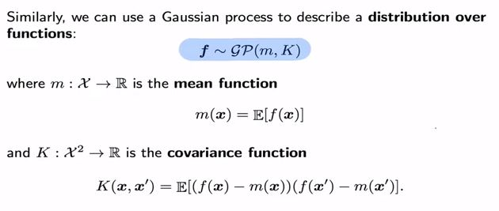

Gaussian Process (GP) is refer to collection of random variables such that any subset of these variables is jointly Gaussian. We can use GP to describe distribution over functions. The Kernel is the essential component for GP and it mainly for compute covariance between datapoints. 

The Gaussian Processes Regression is an application of GP to perform regression. 

###References:
1. http://www.gaussianprocess.org/gpml/chapters/RW.pdf
2. https://towardsdatascience.com/gaussian-process-regression-from-first-principles-833f4aa5f842

