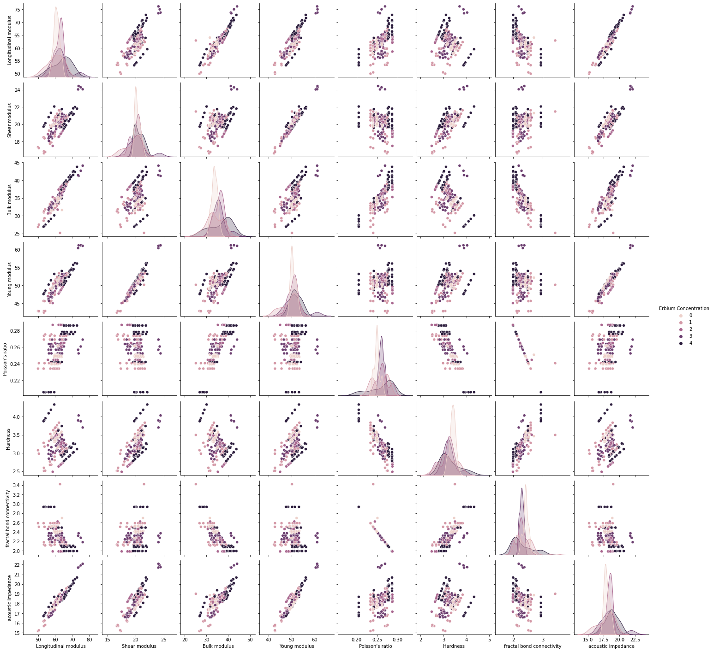
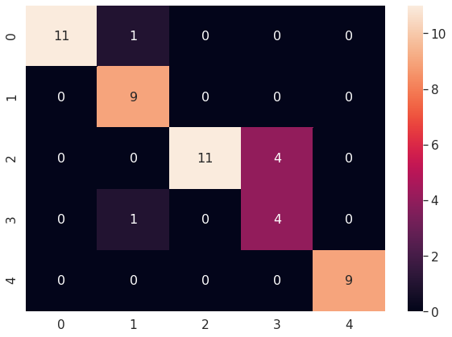
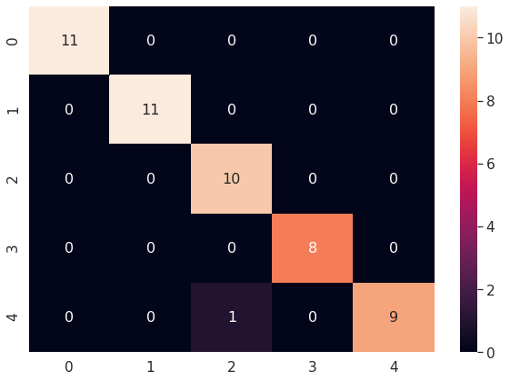
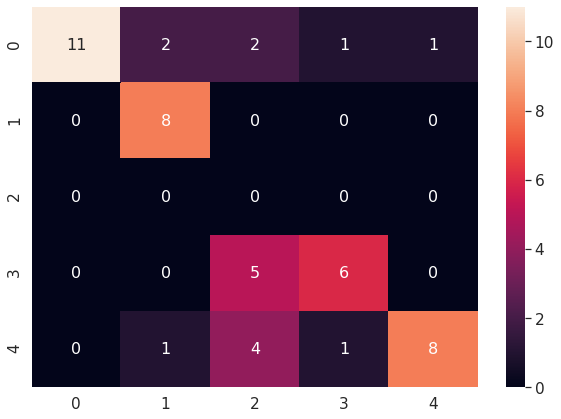
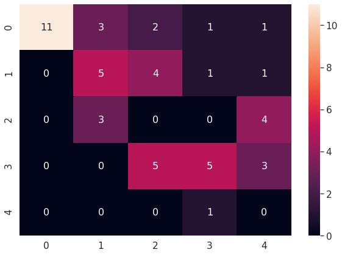
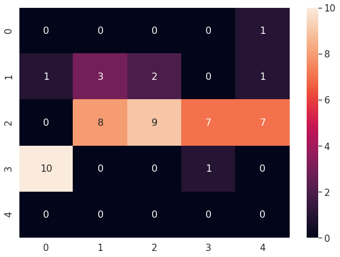

# Erbium Chemical Compound Analysis

These experiment works are associated to a collaborative research paper regarding Erbium compound analysis, and the lab experiments results are obtained from our collaborator's PhD works.

**In progress of publication submission

---
## Table of contents
  * [Erbium Density Prediction](#Erbium_Density_Prediction)
  * [Erbium Concentration Prediction](#Erbium_Concentration_Classification)

### [Erbium Density Prediction](Erbium_Density_Prediction)

**Model used:**
<ul>
<li>Linear Regression pure math - <b>Accuracy 78.71%</b></li>
<li>Linear Regression from math scratch with TensorFlow 2 - <b>Accuracy 90.06%</b></li>
<li>Linear Regression using dense TensorFlow 2 - <b>Accuracy 86.42%</b></li>
<li>Linear Regression using Scikit-Learn - <b>Accuracy 86.76%</b></li>
<li>Decision Tree Regression using Scikit-Learn - <b>Accuracy 88.93%</b></li>
<li>Random Forest Regression using Scikit-Learn - <b>Accuracy 90.18%</b></li>
<li>Deep Neural Networks Regression TensorFlow 2 - <b>Accuracy 88.57%</b></li>
</ul>

**Steps**
<ol>
<li>Gather data</li>
<li>Preprocess data and split into train and test set</li>
<li>Normalize data if necessary</li>
<li>Build the model</li>
<li>Train the model</li>
<li>Perform testing</li>
<li>Tune the parameters if necessary</li>
</ol>

### [Erbium Concentration Prediction](Erbium_Concentration_Classification)

**Model used:**
<ul>
<li>Deep Neural Networks with TensorFlow-v2 - <b>Accuracy 0.88</b></li>
<li>Decision Tree Classification using Scikit-Learn - <b>Accuracy 0.98</b></li>
<li>Multi-Layer Peceptron using Scikit-Learn - <b>Accuracy 0.66</b></li>
<li>Logistic Regression using Scikit-Learn - <b>Accuracy 0.42</b></li>
<li>Stochastic Gradient Descent using Scikit-Learn - <b>Accuracy 0.26</b></li>
</ul>

**Pairplot of properties and concentrations**

**Sample of classification results**

DNN with TF-v2

Decision Tree with sklearn

MLP with sklearn

Logistic Regression with sklearn

SGD with sklearn

---

**Special notes for our members**

<ol>
<li>Why export data from xlsx format into csv format? </li>

 The CSV files are faster and also consumes less memory whereas Excel consumes more memory while importing data. CSV files are commonly used for data exchange between platforms, making the data “raw” again so it can be processed by different applications. This is the most flexible data format. XLSX is the file extension for a Microsoft Excel Spreadsheet. 

</ol>

1) ANN is use to predict the best erbium concentration for density and molar volume parameter towards fiber optics application.
2) The best is Erbium 0.05, because it has high density and larger compactness. However, the result of molar volume is giving the best when the erbium is 0.01.
3) Come out model that can predict erbium concentration based on the features.
4) Since the actual output of the erbium concentration is descrete value, range from 0.01 to 0.05, and the variation between them is very small causing difficulty in accurate prediction. Therefore, this notebook is to shows the problem on the prediction and we will work on another notebook to treat it as classification task.
5) Per classification experiment, it seem like accuracy very high. We need to check if the training feature data has direct relationship to label.
6) Per domain expert feedback, no directly relationship between any features.

What we can put in the paper for apply machine learning part:
1) The algorithms that used for prediction, discuss about each model
2) The illustration of algorithms
3) Prediction results, compare accuracy and determine which model perform best. 

Proceed to writing.

